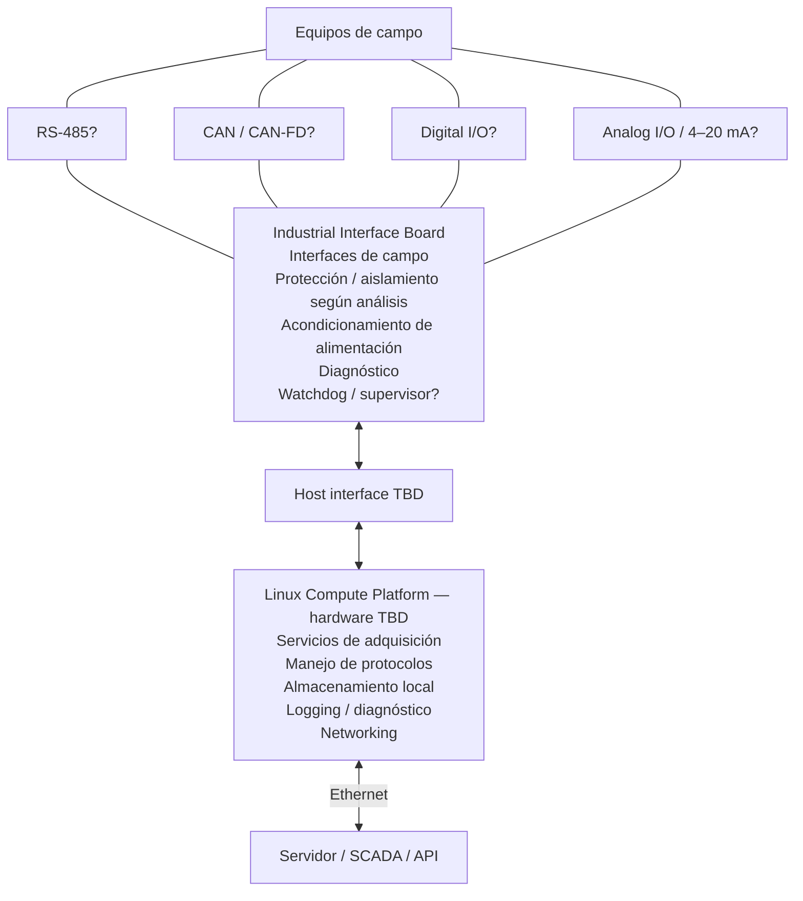

# Industrial Linux Edge Gateway

## Revisión 0.2 — Requisitos preliminares de producto y sistema

| Campo | Valor |
|---|---|
| Proyecto | Industrial Linux Edge Gateway (nombre provisional) |
| Tipo de documento | Requisitos preliminares de producto y sistema |
| Revisión | 0.2 |
| Estado | Preliminar; no liberado para diseño detallado |
| Fecha | 2026-09-08 |
| Propietario | Equipo del proyecto universitario de Diseño Electrónico |
| Archivo maestro | `docs/industrial_linux_gateway_requirements.md` |

> **Estado de plataforma.** La plataforma de cómputo Linux no ha sido seleccionada en esta revisión. El host deberá ejecutar Linux; modelo, CPU, memoria, almacenamiento, interfaces, alimentación, tamaño y consumo permanecen TBD. La selección se realizará posteriormente contra los requisitos del host (SR-LNX) y las restricciones de alimentación, entorno y mecánica.

---

## 1. Propósito, alcance y convenciones

Especificación preliminar de un gateway industrial basado en Linux para integrar equipos legacy con redes IP. Define requisitos, prioridades, decisiones pendientes y verificación; excluye selección de componentes, pines, esquemático, PCB y diseño detallado.

El sistema combina un host Linux para procesamiento, almacenamiento y comunicaciones con una carrier/interface board para adaptación industrial. Se orienta a robustez, diagnóstico, mantenibilidad y testabilidad, con alcance realizable para el proyecto.

### 1.1 Convenciones

- **Deberá:** requisito verificable; **TBD:** parámetro o decisión pendiente de evidencia.
- **Must / Should / Could / Won't:** prioridad MoSCoW para Rev. A. Los candidatos no son obligatorios hasta su aceptación; las obligaciones condicionales aplican solo si se incorpora la función.
- **Origen:** necesidad, caso de uso o decisión que justifica el requisito.
- Producto (§5) define comportamiento; sistema (§7) lo descompone por responsabilidad.

### 1.2 Verificación

| Código | Método | Evidencia |
|---|---|---|
| I | Inspección | Documentación, configuración, montaje o marcado. |
| A | Análisis | Cálculo, simulación o evaluación técnica. |
| T | Ensayo | Medición o estímulo controlado. |
| D | Demostración | Ejecución funcional representativa. |

Un requisito no puede cerrarse mientras su criterio de aceptación siga siendo TBD.

---

## 2. Contexto, hechos y estado de decisiones

### 2.1 Hechos conocidos

| ID | Hecho |
|---|---|
| H-01 | La mini PC específica todavía no ha sido seleccionada. |
| H-02 | El proyecto incluye el diseño de una carrier/interface board industrial. |
| H-03 | El sistema integrará equipos industriales externos con una red IP o servidor externo. |
| H-04 | No existe todavía esquemático ni PCB del gateway. |
| H-05 | No se han realizado ensayos del gateway. |

### 2.2 Decisiones tomadas para esta revisión

| ID | Decisión | Consecuencia documental |
|---|---|---|
| D-01 | El sistema se divide conceptualmente en host Linux y carrier industrial. | Se asignan responsabilidades sin seleccionar implementación física. |
| D-02 | La conectividad principal hacia redes superiores será Ethernet cableado. | Ethernet forma parte de la línea base de Rev. A. |
| D-03 | Wi-Fi queda fuera del alcance inicial. | Se clasifica como Won't para Rev. A. |
| D-04 | LTE solo podrá considerarse como expansión futura mediante módulo comercial. | No se diseña RF propia en Rev. A. |
| D-05 | No se diseñará antena ni front-end RF propio. | Se registra como exclusión explícita. |
| D-06 | No se seleccionarán componentes ni mini PC en esta revisión. | Los parámetros dependientes de plataforma permanecen TBD. |

### 2.3 Candidatos no congelados

| ID | Candidato | Estado y condición para decidir |
|---|---|---|
| C-01 | Alimentación nominal de 24 VDC | Requiere confirmar la fuente disponible, rango, potencia y perturbaciones del entorno. |
| C-02 | RS-485 | Requiere confirmar equipos y protocolos del caso de uso demostrador. |
| C-03 | CAN o CAN-FD | Requiere confirmar equipos, velocidad, topología y protocolo del caso de uso. |
| C-04 | Entradas digitales industriales de 24 V | Requiere justificar señales concretas, cantidad y comportamiento. |
| C-05 | Salidas digitales industriales | Requiere justificar cargas, cantidad, estado seguro y diagnóstico. |
| C-06 | Entradas analógicas o lazo 4-20 mA | Requiere un caso de uso y requisitos metrológicos. |
| C-07 | MCU auxiliar | Requiere demostrar que las funciones de tiempo real, supervisión o seguridad no pueden satisfacerse de forma más simple. |
| C-08 | Aislamiento galvánico por interfaz o dominio | Requiere análisis de tierras, seguridad, ruido y fallos. |
| C-09 | Watchdog o supervisor independiente | Requiere cerrar el análisis de recuperación y las capacidades de la mini PC. |

### 2.4 Supuestos de trabajo

Los siguientes supuestos permiten avanzar, pero no constituyen hechos ni requisitos aceptados:

| ID | Supuesto | Acción de validación |
|---|---|---|
| S-01 | El demostrador dispondrá de al menos un equipo industrial con una interfaz documentada. | Identificar equipo, manual, protocolo y acceso para ensayos. |
| S-02 | La red superior permitirá realizar pruebas Ethernet con un servidor o SCADA. | Definir infraestructura, direccionamiento y servicio de prueba. |
| S-03 | Será posible modificar la configuración del Linux instalado o instalar una distribución compatible. | Confirmar restricciones administrativas y soporte del proveedor. |
| S-04 | La mini PC ofrecerá al menos un medio viable de comunicación con la carrier. | Evaluar las plataformas disponibles antes de congelar arquitectura. |

---

## 3. Arquitectura funcional preliminar

Ethernet se adopta como uplink principal por robustez, facilidad de diagnóstico y compatibilidad con redes industriales.

**Leyenda:** “?” identifica funciones candidatas, no puertos comprometidos. La dirección de datos y los comandos autorizados dependen del caso de uso. El diagrama representa funciones, no conexiones eléctricas ni topologías de potencia.

| Bloque | Responsabilidad | Pendiente |
|---|---|---|
| Host Linux | Adquisición, procesamiento, protocolos, almacenamiento de sistema/configuración/registros/cola, networking y diagnóstico de alto nivel. | Plataforma, distribución, recursos e interfaces físicas. |
| Carrier industrial | Acondicionamiento de alimentación, protección, interfaces de campo, I/O seleccionadas y diagnóstico de bajo nivel. | Topología, componentes, canales, aislamiento y supervisión justificados. |
| Enlace host-carrier | Datos, configuración, diagnóstico y control interno. | Medio, protocolo, ancho de banda y aislamiento. |
| Watchdog/supervisor candidato | Detectar fallos cubiertos y solicitar o provocar recuperación. | Necesidad, independencia, implementación y autoridad. |

La distribución de protocolos entre Linux, circuitos dedicados y un posible MCU permanece abierta. El perfil de alimentación es TBD; 24 VDC nominal es candidato. La alimentación del host y la carrier se definirá contra SR-PWR, sin fijar aquí su distribución física.

### 3.1 Criterio para evaluar un MCU auxiliar

No se exige un MCU. Su incorporación requiere justificar funciones que el host y una supervisión más simple no satisfagan: respuesta ante bloqueo de Linux, estado seguro de salidas, adquisición determinista, supervisión de potencia o diagnóstico sin host. Se evaluarán también complejidad, firmware, testabilidad y nuevos modos de fallo.

## 4. Actores y casos de uso

| Actor | Interacción |
|---|---|
| Equipo industrial | Datos, estados y comandos autorizados mediante interfaz TBD. |
| Servidor/SCADA/API | Recepción de datos, consulta de estado y configuración o comandos autorizados por Ethernet/IP. |
| Técnico/usuario | Instalación, configuración, diagnóstico, actualización y recuperación; acceso y permisos TBD. |
| Fuente industrial | Energía dentro del perfil de entrada TBD. |
| Red Ethernet | Conectividad IP, incluidas interrupciones temporales. |

| Caso | Comportamiento esperado |
|---|---|
| UC-01 — Integrar un equipo con IP | Con equipo, interfaz y protocolo documentados y gateway alimentado/configurado: adquirir, validar, procesar y transmitir datos; asociar tiempo cuando aplique y registrar resultados. Manejar datos inválidos, equipo/interfaz/red no disponibles y rechazo del servidor. |
| UC-02 — Interrupción de red | Detectar indisponibilidad, conservar y diagnosticar datos pendientes dentro de la capacidad definida; recuperar transferencia sin borrar datos antes del criterio de entrega. |
| UC-03 — Fallo de alimentación | Detectar o tolerar la degradación, limitar corrupción y estados indeterminados; autoarrancar, comprobar estado y recuperar operación o informar fallo. |
| UC-04 — Diagnóstico de campo | Distinguir fallos de alimentación, host, carrier, campo y red; consultar versiones/configuración, ejecutar recuperación autorizada y registrar resultado cuando sea posible. |
| UC-05 — Configuración y mantenimiento | Identificar versiones, validar cambios autorizados antes de activarlos, actualizar de forma controlada y recuperar una versión/configuración operativa ante fallo. |
| UC-06 — Verificación integrada | Inspeccionar e identificar la unidad, probar alimentación/interfaces/diagnóstico y registrar versiones y resultados; localizar fallos hasta un bloque mantenible cuando sea posible. |

La matriz de §8 concentra la trazabilidad de estos casos.

---

## 5. Requisitos de producto

### 5.1 Requisitos funcionales

| ID | Requisito | Especificación/valor | MoSCoW Rev. A | Origen |
|---|---|---|---|---|
| F-01 | El producto deberá adquirir datos de al menos un equipo industrial representativo del caso de uso seleccionado. | Equipo, datos, tasa y protocolo: TBD | Must | UC-01 |
| F-02 | El producto deberá comunicarse con el equipo industrial mediante al menos una interfaz de campo seleccionada a partir del caso de uso. | Interfaz final: TBD; candidatos principales: RS-485 y CAN/CAN-FD | Must | UC-01, C-02, C-03 |
| F-03 | El producto deberá procesar localmente los datos necesarios para el caso de uso demostrador. | Transformaciones, validación y latencia: TBD | Must | UC-01 |
| F-04 | El producto deberá transmitir a un servidor/SCADA los datos definidos mediante Ethernet cableado. | Protocolo, formato, seguridad y rendimiento: TBD | Must | UC-01, D-02 |
| F-05 | El producto deberá detectar una interrupción de comunicación con el destino superior. | Tiempo y criterio de detección: TBD | Must | UC-02 |
| F-06 | El producto deberá almacenar temporalmente los datos pendientes durante interrupciones de red y reanudar su transferencia al recuperarse la conectividad. | Capacidad, retención y política de reenvío: TBD | Must | UC-02 |
| F-07 | El producto deberá arrancar automáticamente y recuperar una condición operativa definida después del retorno de una alimentación válida. | Tiempo de recuperación y estado operativo: TBD | Must | UC-03 |
| F-08 | El producto deberá proporcionar diagnóstico del estado de alimentación, comunicaciones de campo, host Linux y enlace superior hasta el nivel soportado por la arquitectura. | Variables, acceso y granularidad: TBD | Must | UC-01, UC-04 |
| F-09 | El producto deberá permitir consultar identificación, versiones y configuración, y aplicar cambios mediante un procedimiento controlado. | Medio de acceso, permisos y procedimiento: TBD | Should | UC-04, UC-05 |
| F-10 | El producto podrá adquirir o accionar señales industriales discretas si el caso de uso seleccionado lo requiere. | Cantidad y características: TBD | Could | C-04, C-05 |
| F-11 | El producto podrá adquirir señales analógicas industriales o 4-20 mA si un caso de uso lo justifica. | Cantidad y desempeño metrológico: TBD | Could | C-06 |
| F-12 | El producto no incorporará conectividad Wi-Fi en Rev. A. | No incluida | Won't | D-03 |
| F-13 | El producto no incorporará diseño propio de antena ni front-end RF en Rev. A. | No incluido | Won't | D-04, D-05 |
| F-14 | El producto podrá reservar capacidad de expansión LTE mediante un módulo comercial si un caso de uso futuro lo justifica. | Interfaz y módulo: TBD; sin diseño RF propio | Could | D-04 |
| F-15 | El producto no incorporará LTE como función base de Rev. A. | No incluido como función base | Won't | D-04 |

### 5.2 Requisitos no funcionales

| ID | Requisito | Especificación/valor | MoSCoW Rev. A | Origen |
|---|---|---|---|---|
| NF-01 | El producto deberá mantener un comportamiento determinable ante pérdida, corrupción o ausencia de datos de campo. | Estados, timeouts y política: TBD | Must | UC-01, seguridad |
| NF-02 | El producto deberá preservar la consistencia de los datos pendientes frente a interrupciones de red y reinicios razonables. | Modelo de entrega y criterio de integridad: TBD | Must | UC-02 |
| NF-03 | El producto deberá evitar estados de salida no definidos durante arranque, apagado, brownout y reinicio. | Estado seguro por salida: TBD | Must si se incluyen salidas | UC-03, seguridad |
| NF-04 | El producto deberá operar de forma continua durante el periodo definido para el demostrador y registrar reinicios o fallos detectables. | Duración y disponibilidad objetivo: TBD | Must | UC-03, entorno |
| NF-05 | El producto deberá ser mantenible mediante documentación versionada, identificación de versiones y procedimientos reproducibles. | Artefactos y formato: TBD | Must | UC-04, UC-05 |
| NF-06 | El producto deberá permitir localizar fallos al menos entre los bloques de alimentación, carrier, host, interfaz de campo y red superior cuando la arquitectura lo permita. | Cobertura diagnóstica: TBD | Should | UC-04 |
| NF-07 | El software y la configuración deberán poder actualizarse de manera controlada sin sustituir hardware. | Mecanismo, autenticación y recuperación: TBD | Should | UC-05 |
| NF-08 | La carrier deberá diseñarse para fabricación y prueba mediante procesos documentados acordes con los recursos del proyecto. | Reglas DFM/DFT y cobertura: TBD | Must | UC-06 |
| NF-09 | El producto deberá considerar ESD, transientes, EMI/EMC y aislamiento en función del entorno y de las interfaces finalmente seleccionadas. | Niveles y criterios: TBD | Must | Restricción del entorno |
| NF-10 | El producto deberá tolerar las condiciones mecánicas y ambientales definidas para su escenario de demostración o instalación. | Temperatura, humedad y vibración: TBD | Must | Restricción del entorno |

---

## 6. Aplicación de MoSCoW

Las tablas de requisitos son la referencia normativa. Exigir una interfaz de campo no selecciona RS-485 ni CAN/CAN-FD. Exigir evaluación de aislamiento o recuperación no impone aislamiento específico, MCU ni watchdog independiente. Las I/O, 24 VDC y expansión LTE conservan las condiciones de §2.3 y §5.

---

## 7. Requisitos de sistema

### 7.1 Alimentación - SR-PWR

| ID | Requisito | Especificación/valor | MoSCoW | Origen | Verificación |
|---|---|---|---|---|---|
| SR-PWR-01 | El sistema deberá aceptar la fuente de alimentación industrial definida para el escenario de uso. | Nominal candidata: 24 VDC; rango, potencia y conector: TBD | Must | UC-03, C-01 | I, A, T |
| SR-PWR-02 | El sistema deberá impedir daño o condición peligrosa ante inversión de polaridad dentro del perfil de entrada definido. | Perfil y respuesta: TBD | Must | UC-03, seguridad | A, T |
| SR-PWR-03 | El sistema deberá limitar los efectos de una sobrecorriente o cortocircuito interno conforme a una estrategia documentada. | Umbrales, energía y recuperación: TBD | Must | Seguridad | A, T |
| SR-PWR-04 | El sistema deberá limitar las sobretensiones y transientes de entrada hasta niveles compatibles con los circuitos internos. | Forma de onda, nivel y criterio: TBD | Must | Entorno, NF-09 | A, T |
| SR-PWR-05 | El sistema deberá atenuar las perturbaciones conducidas entre la entrada y los circuitos internos conforme al objetivo EMC definido. | Banda, atenuación y límites: TBD | Must | Entorno, NF-09 | A, T |
| SR-PWR-06 | El sistema deberá generar todos los rails requeridos por el host y la carrier dentro de sus tolerancias durante los modos definidos. | Rails, secuencia, tolerancias y carga: TBD | Must | Arquitectura | A, T |
| SR-PWR-07 | El sistema deberá llevar el host y la carrier a estados definidos durante brownout, pérdida y retorno de alimentación. | Umbrales, tiempos y estados: TBD | Must | UC-03, NF-03 | A, T, D |
| SR-PWR-08 | El sistema deberá proporcionar información de estado de alimentación suficiente para diagnóstico y recuperación. | Power-good, mediciones o eventos: TBD | Should | UC-04 | I, T, D |

### 7.2 Comunicaciones - SR-COM

| ID | Requisito | Especificación/valor | MoSCoW | Estado | Origen | Verificación |
|---|---|---|---|---|---|---|
| SR-COM-01 | El sistema deberá proporcionar conectividad Ethernet cableada entre el host Linux y la red superior. | Velocidad, conector, cable y alcance: TBD | Must | Aceptado | D-02, UC-01 | I, T, D |
| SR-COM-02 | El sistema deberá proporcionar al menos una interfaz de campo eléctrica y lógicamente compatible con el equipo seleccionado. | Interfaz, protocolo, velocidad y topología: TBD | Must | Aceptado | F-02, UC-01 | I, A, T, D |
| SR-COM-03 | Si se selecciona RS-485, la interfaz deberá satisfacer la topología, terminación, polarización, protección, modo dúplex y aislamiento definidos por el caso de uso. | Todos los parámetros: TBD | Should | Candidato | C-02, UC-01 | I, A, T |
| SR-COM-04 | Si se selecciona CAN o CAN-FD, la interfaz deberá satisfacer velocidad, carga de bus, terminación, protección, aislamiento y protocolo definidos por el caso de uso. | Todos los parámetros: TBD | Should | Candidato | C-03, UC-01 | I, A, T |
| SR-COM-05 | Cada interfaz de campo seleccionada deberá detectar y reportar las condiciones de error observables por su arquitectura. | Condiciones y contadores: TBD | Must | Aceptado | UC-04, F-08 | A, T, D |
| SR-COM-06 | La arquitectura deberá definir el límite eléctrico y lógico entre la carrier y la mini PC sin depender de una interfaz no confirmada de la plataforma. | Medio y protocolo interno: TBD | Must | Aceptado | H-02, D-01 | I, A |
| SR-COM-07 | La interfaz Ethernet deberá recuperar automáticamente la comunicación tras una interrupción temporal, sin requerir ciclo manual de potencia. | Tiempo y condiciones: TBD | Must | Aceptado | UC-02 | T, D |

### 7.3 Entradas y salidas industriales - SR-IO

| ID | Requisito | Especificación/valor | MoSCoW | Estado | Origen | Verificación |
|---|---|---|---|---|---|---|
| SR-IO-01 | Si se incluyen entradas digitales, el sistema deberá interpretar los estados eléctricos definidos sin aplicar niveles industriales directamente al host Linux. | Cantidad, niveles, umbrales y tipo: TBD | Could | Candidato | C-04 | I, A, T |
| SR-IO-02 | Si se incluyen salidas digitales, cada salida deberá adoptar un estado seguro definido durante arranque, apagado, brownout y pérdida de control del host. | Cantidad, cargas y estado seguro: TBD | Could; Must si hay salidas | Candidato | C-05, NF-03 | A, T |
| SR-IO-03 | Si se incluyen salidas digitales, el sistema deberá limitar los efectos de sobrecarga y cargas transientes conforme al perfil definido. | Corriente, energía y recuperación: TBD | Could; Must si hay salidas | Candidato | C-05, seguridad | A, T |
| SR-IO-04 | Si se incluyen entradas analógicas o 4-20 mA, el sistema deberá cumplir el rango, exactitud, resolución, impedancia, ancho de banda y protección definidos. | Parámetros metrológicos: TBD | Could | Candidato | C-06 | A, T |
| SR-IO-05 | Las I/O seleccionadas deberán exponer diagnóstico suficiente para distinguir estado de proceso de fallos detectables del canal. | Cobertura: TBD | Should | Candidato | UC-04 | A, T, D |

### 7.4 Host Linux - SR-LNX

| ID | Requisito | Especificación/valor | MoSCoW | Origen | Verificación |
|---|---|---|---|---|---|
| SR-LNX-01 | La mini PC deberá contar con soporte estable para una distribución Linux apta para el ciclo del proyecto. | Distribución, kernel y periodo de soporte: TBD | Must | H-01, UC-01 | I, D |
| SR-LNX-02 | La mini PC deberá proporcionar capacidad de procesamiento, memoria y recursos de I/O suficientes para las cargas del gateway. | Presupuesto de recursos y margen: TBD | Must | UC-01 | A, T |
| SR-LNX-03 | El host deberá proporcionar almacenamiento no volátil suficiente para sistema, registros, configuración y datos temporales. | Capacidad, resistencia y margen: TBD | Must | UC-02 | I, A, T |
| SR-LNX-04 | El software deberá mantener una cola persistente de datos pendientes conforme a una política documentada de inserción, confirmación, reintento y descarte. | Capacidad, orden y semántica de entrega: TBD | Must | UC-02, NF-02 | I, T, D |
| SR-LNX-05 | La mini PC deberá permitir autoarranque después de la restauración de una alimentación válida. | Tiempo hasta servicio: TBD | Must | UC-03 | I, T, D |
| SR-LNX-06 | El sistema Linux deberá ejecutar automáticamente los servicios del gateway y supervisar su estado. | Gestor, dependencias y política de reinicio: TBD | Must | UC-03, arquitectura | I, T, D |
| SR-LNX-07 | El sistema deberá conservar e informar versiones de software y configuración, y soportar un procedimiento controlado de actualización y recuperación. | Mecanismo y política: TBD | Should | UC-05 | I, T, D |
| SR-LNX-08 | La mini PC deberá proporcionar puertos suficientes y compatibles para Ethernet, carrier, desarrollo y mantenimiento requeridos. | Tipo y cantidad: TBD | Must | H-02, D-01 | I, A, D |
| SR-LNX-09 | La plataforma deberá soportar un mecanismo interno o externo de watchdog compatible con la estrategia de recuperación seleccionada. | Cobertura, timeout y autoridad de reinicio: TBD | Should | UC-03, C-09 | I, A, T |

### 7.5 Diagnóstico - SR-DIA

| ID | Requisito | Especificación/valor | MoSCoW | Origen | Verificación |
|---|---|---|---|---|---|
| SR-DIA-01 | El sistema deberá registrar eventos de comunicación de campo y de red suficientes para determinar estado, errores y recuperaciones. | Eventos, severidad y retención: TBD | Must | UC-01, UC-04 | I, T, D |
| SR-DIA-02 | El sistema deberá registrar el inicio, fin y efecto observable de interrupciones de conectividad superior. | Resolución temporal y campos: TBD | Must | UC-02 | T, D |
| SR-DIA-03 | El sistema deberá registrar la causa de reinicio cuando dicha causa sea observable por el hardware o software seleccionado. | Causas distinguibles: TBD | Must | UC-03 | A, T, D |
| SR-DIA-04 | El sistema deberá proporcionar al técnico un medio documentado para consultar estado, registros, versiones y configuración. | Medio y permisos: TBD | Must | UC-04 | I, D |
| SR-DIA-05 | El sistema deberá identificar por separado, hasta donde lo permita la arquitectura, fallos del host, carrier, alimentación, interfaz de campo y Ethernet. | Cobertura y códigos: TBD | Should | UC-04, NF-06 | A, T, D |
| SR-DIA-06 | El sistema deberá mantener una referencia temporal suficiente para ordenar eventos y datos conforme al caso de uso. | Fuente, exactitud y retención de hora: TBD | Must | UC-01, UC-04 | A, T |
| SR-DIA-07 | Los indicadores locales, si se incluyen, deberán tener estados y significados no ambiguos documentados. | Indicadores y semántica: TBD | Should | UC-04 | I, D |

### 7.6 Protección y seguridad funcional del equipo - SR-SAF

> Protección eléctrica y comportamiento seguro del equipo; no implica certificación de seguridad funcional. SR-SAF-05 establece el requisito preliminar de acceso seguro. Los detalles de ciberseguridad se cerrarán con los servicios, protocolos y modelo de amenazas.

| ID | Requisito | Especificación/valor | MoSCoW | Origen | Verificación |
|---|---|---|---|---|---|
| SR-SAF-01 | El sistema deberá pasar a estados definidos ante alimentación fuera de rango, fallo de software detectable o pérdida de comunicación relevante. | Estado por modo de fallo: TBD | Must | UC-03, seguridad | A, T |
| SR-SAF-02 | Las conexiones externas deberán incorporar una estrategia documentada de protección frente a ESD y transientes acorde con el entorno definido. | Puertos, niveles y criterio: TBD | Must | NF-09 | I, A, T |
| SR-SAF-03 | La necesidad de aislamiento galvánico deberá evaluarse por cada interfaz externa y dominio de alimentación antes del diseño detallado. | Criterios y tensión, si aplica: TBD | Must | C-08, entorno | I, A |
| SR-SAF-04 | Cuando se requiera aislamiento, el sistema deberá mantener la separación eléctrica y física definida en todos los elementos que crucen la barrera. | Tensión, distancias y excepciones: TBD | Must si aplica | SR-SAF-03 | I, A, T |
| SR-SAF-05 | El sistema deberá impedir que comandos, reinicios o actualizaciones no autorizados se habiliten por defecto en interfaces de red expuestas. | Modelo de acceso y autenticación: TBD | Must | UC-05, seguridad | I, A, T |
| SR-SAF-06 | Los mecanismos de recuperación deberán evitar ciclos de reinicio indefinidos sin evidencia diagnóstica persistente cuando sea técnicamente posible. | Límites y política: TBD | Should | UC-03, UC-04 | A, T |

### 7.7 Ambientales y EMC - SR-ENV

| ID | Requisito | Especificación/valor | MoSCoW | Origen | Verificación |
|---|---|---|---|---|---|
| SR-ENV-01 | El sistema deberá operar dentro del rango de temperatura definido para el escenario objetivo. | Rango y gradientes: TBD | Must | NF-10 | A, T |
| SR-ENV-02 | El sistema deberá operar o almacenarse dentro de los límites de humedad y condensación definidos. | Límites: TBD | Must | NF-10 | A, T |
| SR-ENV-03 | La arquitectura deberá considerar inmunidad frente a ESD, EFT/transientes y perturbaciones conducidas/radiadas de acuerdo con el entorno documentado. | Fenómenos, niveles y criterios: TBD | Must | NF-09 | A, T |
| SR-ENV-04 | El diseño deberá controlar emisiones conducidas y radiadas conforme al objetivo que se defina antes del diseño detallado. | Límites y configuración: TBD | Must | NF-09 | A, T |
| SR-ENV-05 | El sistema deberá tolerar el perfil de vibración y choque definido para instalación, transporte y demostración. | Perfil y criterio: TBD | Must | NF-10 | I, A, T |
| SR-ENV-06 | El sistema deberá soportar operación continua durante el intervalo de validación definido sin pérdida de función no recuperable. | Duración y carga: TBD | Must | NF-04 | T |

Ningún requisito de esta sección afirma cumplimiento IEC, certificación o nivel de inmunidad específico.

### 7.8 Mecánicos - SR-MEC

| ID | Requisito | Especificación/valor | MoSCoW | Origen | Verificación |
|---|---|---|---|---|---|
| SR-MEC-01 | El conjunto deberá alojar la mini PC seleccionada, la carrier, el cableado y los elementos de montaje sin exceder las envolventes que se definan. | Dimensiones y montaje: TBD | Must | H-02, arquitectura | I, A |
| SR-MEC-02 | Los conectores de alimentación, campo, Ethernet y servicio deberán ser accesibles y estar identificados de forma no ambigua. | Ubicación y marcado: TBD | Must | UC-04, UC-05 | I, D |
| SR-MEC-03 | El diseño mecánico deberá permitir ensamblaje, inspección, prueba y sustitución de los módulos mantenibles definidos. | Accesos y herramientas: TBD | Must | UC-06, NF-08 | I, D |
| SR-MEC-04 | El sistema deberá proporcionar retención mecánica y alivio de esfuerzos adecuados para los cables y conectores del entorno definido. | Fuerzas y método: TBD | Should | NF-10 | I, A, T |
| SR-MEC-05 | El grado de protección del envolvente no se fijará hasta definir el lugar de instalación y exposición. | Grado IP: TBD | Won't definir en esta revisión | Pregunta abierta | I |

### 7.9 Mantenibilidad - SR-MNT

| ID | Requisito | Especificación/valor | MoSCoW | Origen | Verificación |
|---|---|---|---|---|---|
| SR-MNT-01 | El sistema deberá exponer identificación única de las revisiones de hardware, software y configuración instaladas. | Formato y ubicación: TBD | Must | UC-04, UC-05 | I, D |
| SR-MNT-02 | La documentación deberá mantener trazabilidad entre requisitos, decisiones de diseño, pruebas y resultados. | Herramienta y formato: Markdown/Git; detalle TBD | Must | Ingeniería de requisitos | I |
| SR-MNT-03 | El sistema deberá contar con un procedimiento documentado de instalación, configuración, respaldo y recuperación. | Procedimiento: TBD | Must | UC-05 | I, D |
| SR-MNT-04 | La arquitectura deberá permitir reemplazar la mini PC o la carrier sin perder el registro de compatibilidad entre versiones. | Matriz de compatibilidad: TBD | Should | D-01, UC-05 | I, D |
| SR-MNT-05 | El sistema deberá preservar o restaurar la configuración válida después de una actualización fallida conforme a la estrategia definida. | Estrategia y límites: TBD | Should | UC-05, NF-07 | A, T |

### 7.10 Testabilidad - SR-TST

| ID | Requisito | Especificación/valor | MoSCoW | Origen | Verificación |
|---|---|---|---|---|---|
| SR-TST-01 | La carrier deberá proporcionar acceso de prueba a los rails y señales críticas definidos durante el diseño. | Lista, geometría y carga admisible: TBD | Must | UC-06, DFT | I, T |
| SR-TST-02 | La arquitectura deberá permitir verificar por separado la alimentación, cada interfaz de campo, la comunicación host-carrier y el enlace Ethernet. | Estímulos y criterios: TBD | Must | UC-06 | I, T, D |
| SR-TST-03 | Cada requisito de sistema aceptado deberá vincularse con al menos un procedimiento o evidencia de verificación antes de cerrar el diseño. | Matriz de verificación | Must | Ingeniería de requisitos | I |
| SR-TST-04 | Las pruebas deberán registrar versión de hardware, software, configuración, equipos de medida y resultado. | Plantilla y repositorio: TBD | Must | UC-06 | I |
| SR-TST-05 | El diseño de la carrier deberá incluir características DFT suficientes para detectar fallos de ensamblaje relevantes con los recursos disponibles. | Cobertura y recursos: TBD | Must | NF-08 | I, A, T |

---

## 8. Trazabilidad preliminar

| Fuente | Necesidad principal | Requisitos de producto | Requisitos de sistema principales |
|---|---|---|---|
| UC-01 | Integrar equipo industrial con red IP | F-01 a F-04, F-08, NF-01 | SR-COM-01 a SR-COM-06, SR-LNX-01/02/08, SR-DIA-01/06 |
| UC-02 | Conservar y reenviar datos | F-05, F-06, NF-02 | SR-COM-07, SR-LNX-03/04, SR-DIA-02 |
| UC-03 | Recuperarse de fallos de alimentación | F-07, NF-03, NF-04 | SR-PWR-01 a SR-PWR-08, SR-LNX-05/06/09, SR-DIA-03, SR-SAF-01/06 |
| UC-04 | Diagnosticar fallos | F-08, F-09, NF-05, NF-06 | SR-DIA-01 a SR-DIA-07, SR-MNT-01 a SR-MNT-04 |
| UC-05 | Configurar y mantener | F-09, NF-05, NF-07 | SR-LNX-07, SR-SAF-05, SR-MNT-01 a SR-MNT-05 |
| UC-06 | Verificar fabricación e integración | NF-08 | SR-MEC-03, SR-TST-01 a SR-TST-05 |
| Entorno | Robustez eléctrica, EMC y mecánica | NF-09, NF-10 | SR-SAF-02 a SR-SAF-04, SR-ENV-01 a SR-ENV-06, SR-MEC-01 a SR-MEC-05 |

La trazabilidad detallada requisito-prueba se desarrollará cuando los TBD relevantes tengan criterios de aceptación.

---

## 9. Estrategia preliminar de verificación

La validación deberá construirse desde los casos de uso y no limitarse a comprobar interfaces aisladas.

| Nivel | Objetivo | Evidencia prevista |
|---|---|---|
| Revisión de requisitos | Confirmar necesidad, claridad, trazabilidad y ausencia de soluciones prematuras. | Revisión aprobada y lista de TBD actualizada. |
| Análisis de arquitectura | Verificar presupuestos de potencia, recursos, ancho de banda, almacenamiento, aislamiento, térmico y EMC. | Cálculos, simulaciones y decisiones registradas. |
| Prueba de carrier | Verificar rails, protecciones, interfaces, I/O, diagnóstico y DFT. | Procedimientos y registros por revisión de hardware. |
| Integración host-carrier | Verificar arranque, enlace interno, control, diagnóstico y recuperación. | Pruebas reproducibles con versiones identificadas. |
| Prueba de sistema | Ejecutar UC-01 a UC-06 con equipo de campo y servidor/SCADA representativos. | Resultados, logs y matriz requisito-evidencia. |
| Ensayos de robustez | Aplicar perfiles ambientales y eléctricos definidos. | Informes de ensayo; niveles todavía TBD. |

No podrá declararse satisfecho un requisito cuyo criterio de aceptación siga siendo TBD.

---

## 10. Riesgos preliminares

| ID | Riesgo | Consecuencia | Tratamiento inicial | Estado |
|---|---|---|---|---|
| R-01 | La plataforma candidata no expone interfaces, autoarranque o control de potencia suficientes. | Rediseño de la carrier o reducción de alcance. | Evaluar plataformas con una matriz contra SR-LNX antes de congelar arquitectura. | Abierto |
| R-02 | El caso de uso se define tarde o sin acceso a equipo real. | Interfaces y protocolos sin validación representativa. | Seleccionar temprano equipo, manuales, cableado y ventana de ensayo. | Abierto |
| R-03 | El perfil de alimentación y sus transientes no se conoce; 24 VDC sigue siendo candidato. | Protección insuficiente o sobredimensionada. | Caracterizar fuente y entorno antes de seleccionar componentes. | Abierto |
| R-04 | La pérdida de energía corrompe almacenamiento o datos pendientes. | Pérdida de servicio o información. | Definir modelo de datos, sistema de archivos, secuencia de apagado y pruebas de power cycling. | Abierto |
| R-05 | Diferencias de tierra o ruido degradan interfaces de campo. | Errores intermitentes o daño. | Analizar topología, cableado, aislamiento y protección por puerto. | Abierto |
| R-06 | EMI/EMC se considera solo después del layout. | Iteraciones costosas y fallos de ensayo. | Definir entorno, rutas de retorno, filtrado, partición y plan de precompliance antes del PCB. | Abierto |
| R-07 | Un MCU auxiliar se añade sin requisitos claros. | Complejidad, firmware y modos de fallo innecesarios. | Aplicar los criterios de la sección 3.1 y registrar la decisión. | Abierto |
| R-08 | El almacenamiento temporal no tiene capacidad o resistencia suficiente. | Pérdida de datos o desgaste prematuro. | Definir tasa, duración de interrupción, política de reintento y presupuesto de escrituras. | Abierto |
| R-09 | Watchdog incompleto o con autoridad insuficiente. | El sistema no se recupera de ciertos bloqueos. | Construir matriz fallo-detector-acción y probar cada ruta. | Abierto |
| R-10 | Alcance excesivo por incluir múltiples buses e I/O. | Proyecto incompleto o con validación superficial. | Congelar un caso de uso mínimo y aplicar MoSCoW. | Abierto |
| R-11 | Ausencia de requisitos de ciberseguridad cerrados. | Servicios expuestos o mantenimiento inseguro. | Definir activos, superficies, actores y política de actualización al elegir protocolos. | Abierto |
| R-12 | Restricciones mecánicas de la mini PC aparecen tarde. | Carrier o envolvente incompatibles. | Obtener modelos, dimensiones, montaje, térmica y conectores antes del diseño físico. | Abierto |

---

## 11. Limitaciones y exclusiones

Los parámetros sin evidencia se concentran en la lista de TBD (§12). No hay plataforma, equipo demostrador ni protocolo final seleccionados, ni esquemático, PCB o ensayos del gateway.

| Alcance excluido | Referencia o condición |
|---|---|
| Wi-Fi, antena y front-end RF propios en Rev. A | D-03 a D-05; F-12/F-13. |
| LTE como función base | F-15; solo expansión futura/opcional con módulo comercial. |
| Selección de host/componentes, esquemático, pines, PCB y carcasa detallada | Fuera de esta revisión preliminar. |
| Desarrollo completo de protocolos de aplicación | Protocolos y comportamiento pendientes del caso de uso. |
| Certificación, declaraciones IEC/EMC/seguridad/IP, producción en serie y homologación formal | Sin evidencia de conformidad ni alcance de certificación aprobado. |

---

## 12. Lista consolidada de TBD

| ID | TBD por cerrar | Impacto principal | Evidencia necesaria |
|---|---|---|---|
| TBD-01 | Plataforma Linux: modelo, CPU, memoria, almacenamiento, interfaces, alimentación, tamaño, consumo y soporte Linux. | Arquitectura completa | Comparación contra SR-LNX, manuales y pruebas de plataforma. |
| TBD-02 | Equipo industrial y escenario demostrador. | Alcance y validación | Acceso a equipo, manual y necesidad del usuario. |
| TBD-03 | Interfaz de campo y protocolo final. | Carrier y software | Derivación desde TBD-02. |
| TBD-04 | Velocidad, topología, cableado, terminación y aislamiento de la interfaz de campo. | Integridad y protección | Manuales, entorno y análisis de bus. |
| TBD-05 | Perfil de alimentación: nominal, rango, potencia, polaridad, conector, transientes y comportamiento de la fuente. | Protección y conversión | Medición o especificación de instalación. |
| TBD-06 | Rails, secuencias, tolerancias, cargas y margen. | Arquitectura eléctrica | Selección de host e interfaces; presupuesto de potencia. |
| TBD-07 | Umbrales y comportamiento de brownout, apagado y recuperación. | Integridad de datos | Capacidades del host y análisis de almacenamiento. |
| TBD-08 | Datos adquiridos, tasa, latencia y procesamiento local. | Recursos y pruebas | Caso de uso y protocolo. |
| TBD-09 | Protocolo de aplicación, formato, direccionamiento y seguridad de red. | Software e interoperabilidad | Requisitos del servidor/SCADA. |
| TBD-10 | Capacidad de almacenamiento temporal, duración de interrupción, retención y política de descarte. | Almacenamiento | Modelo de tráfico y necesidad de usuario. |
| TBD-11 | Semántica de entrega: confirmación, duplicados, orden y reintentos. | Integridad de datos | Necesidad del servidor y análisis de fallos. |
| TBD-12 | Tiempo de autoarranque y recuperación. | Disponibilidad | Caso de uso y medición de plataforma. |
| TBD-13 | Variables, granularidad, acceso y retención de diagnóstico. | Mantenimiento | Escenarios de fallo y actores. |
| TBD-14 | Fuente, exactitud y retención de tiempo. | Orden de eventos | Caso de uso y conectividad disponible. |
| TBD-15 | Necesidad, cobertura, timeout y autoridad del watchdog/supervisor. | Recuperación | Matriz de fallos y capacidades del host. |
| TBD-16 | Necesidad de MCU auxiliar. | Complejidad de carrier | Evaluación según sección 3.1. |
| TBD-17 | I/O industrial: tipos, cantidades, niveles, cargas, exactitud y estados seguros. | Alcance de carrier | Casos de uso específicos. |
| TBD-18 | Necesidad y características de aislamiento por puerto o dominio. | Seguridad, EMC y costo | Análisis de tierras y fallos. |
| TBD-19 | Temperatura, humedad, condensación, vibración y choque. | Mecánica y selección | Escenario de instalación. |
| TBD-20 | Objetivos de ESD, EFT/transientes, emisiones e inmunidad EMC. | Protección y layout | Entorno y normas aplicables por validar. |
| TBD-21 | Envolvente, montaje, dimensiones, conectores y grado IP. | Diseño mecánico | Mini PC y lugar de instalación. |
| TBD-22 | Duración de operación continua y objetivo de disponibilidad. | Validación | Necesidad académica y operativa. |
| TBD-23 | Procedimiento de actualización, autenticación y recuperación. | Mantenimiento y seguridad | Arquitectura de software y modelo de amenazas. |
| TBD-24 | Estrategia DFM/DFT, puntos de prueba y cobertura. | Fabricación y prueba | Tecnología de PCB y recursos del laboratorio. |
| TBD-25 | Matriz de procedimientos y criterios de aceptación por requisito. | Cierre de verificación | Cierre de los TBD anteriores. |

---

## 13. Preguntas de alcance pendientes

Los parámetros técnicos se gestionan en §12. Antes de congelar alcance se debe resolver:

- ¿El demostrador solo adquiere datos o también envía comandos y acciona salidas? (TBD-02/17).
- ¿Qué fallos requieren recuperación automática y cuáles bloqueo para revisión? (TBD-07/15).
- ¿Qué calendario, presupuesto y recursos de laboratorio limitan ensayos ambientales, EMC y automatización? (TBD-19/20/24/25).
- ¿Se reservará expansión física para LTE comercial sin implementarlo como función base? (F-14/F-15).

---

## 14. Decisiones requeridas para la siguiente revisión

| Prioridad | Decisión | Resultado esperado |
|---:|---|---|
| 1 | Seleccionar el caso de uso demostrador y el equipo industrial. | Flujo, datos, interfaz y criterios de éxito definidos. |
| 2 | Comparar plataformas Linux contra los requisitos del host. | Matriz de conformidad con SR-LNX y candidato preferido. |
| 3 | Seleccionar la interfaz de campo base. | RS-485, CAN/CAN-FD u otra, con justificación trazable. |
| 4 | Definir el perfil de alimentación y el entorno de uso. | Rangos y perturbaciones verificables sin seleccionar componentes aún. |
| 5 | Definir arquitectura de datos y conectividad superior. | Protocolo, formato, almacenamiento y semántica de entrega. |
| 6 | Cerrar estrategia de recuperación y supervisión. | Matriz fallo-detector-acción; decisión preliminar sobre watchdog y MCU. |
| 7 | Evaluar aislamiento y protección por interfaz. | Límites de dominios y objetivos de ensayo. |
| 8 | Congelar el alcance MoSCoW de I/O y expansión LTE. | Lista Rev. A realizable. |
| 9 | Elaborar el plan de verificación. | Matriz requisito-procedimiento-evidencia con criterios cuantitativos. |

---

## 15. Control de revisión

### 15.1 Reglas de edición

- Modificar este archivo mediante commits pequeños y descriptivos.
- No reutilizar IDs eliminados; marcarlos como retirados en una revisión posterior.
- Registrar cambios de requisito en el historial y actualizar trazabilidad, TBD y preguntas abiertas.
- No reemplazar TBD por estimaciones sin registrar la evidencia o decisión que lo justifica.
- Toda decisión que cambie el alcance o la arquitectura deberá identificarse explícitamente.
- Las revisiones liberadas deberán recibir una etiqueta Git o mecanismo equivalente definido por el equipo.

### 15.2 Historial de revisiones

| Revisión | Fecha | Autor | Estado | Descripción |
|---|---|---|---|---|
| 0.1 | 2026-09-07 | Equipo del proyecto / Codex | Preliminary Product and System Requirements | Primera versión: problema, contexto, casos de uso, requisitos de producto y sistema, MoSCoW, diagramas, arquitectura, riesgos, TBD y decisiones siguientes. |
| 0.2 | 2026-09-08 | Equipo del proyecto / Codex | Preliminar | Revisión editorial: compactación de narrativa y duplicados, diagrama funcional consolidado, plataforma Linux pendiente sin atribución de suministro y aclaración de candidatos. Se conservan IDs y prioridades de requisitos. |
